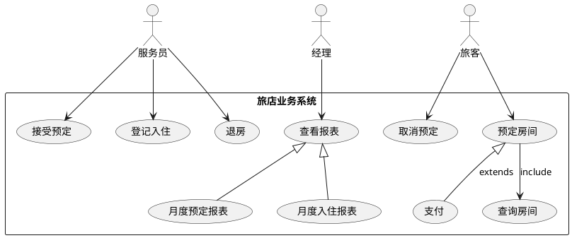
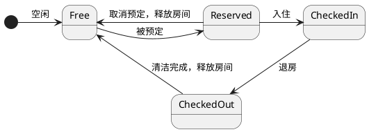
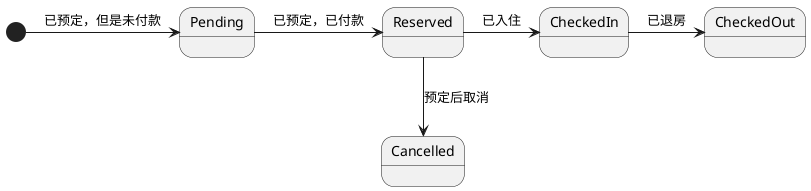

### 需求分析
1. 某旅店可对外开放50个双人间和20个单人间，房间费用视情况、按季节调整，但周一到周五提供半价折扣（周末全价）。
2. 旅客可以直接入住房间（如果有空房），也可提前预订；入住和预订都需要登记个人信息（身份证、手机号）。
3. 旅客提前预订房间时，需提交一定的订金；在入住时间24小时之前，旅客可以取消预订房间，并退回所有订金，而24小时以内则不退还订金。
4. 旅客入住时先交尾款（预定用户）或者住宿费用（现场入住）和押金 30元；待退房时，再对会退押金。
5. 旅客缴纳押金后，服务员激活房卡并交给用户；用户使用房卡打开房门。
6. 退房时，将房卡放入退房机，退房机会自动退还押金。
7. 此外，为了考查旅店的业务情况，服务员每月为经理提供房间的预定情况和入住情况的详细信息。


### 迭代2 需求
#### 用户入住
1. 用户预约可以选择预定的时间段
2. 用户的房卡存在有效期，有效期为入住的时间段，退房最后期限一般为最后一天的12点整
3. 若房卡超过有效期后，房间将无法打开、无法为房间通电
#### 清洁房间
1. 清洁工需要清理处于退房状态的房间
2. 清洁工清理完成后可以提交清理完成，房间将会变为空闲状态
3. 清洁工的房卡可以打开处于退房状态的房间
4. 清洁工的房卡存在有效期，激活房卡后的24小时之内有效，过期后不可使用

### 业务流程
#### 业务活动图
##### 在线预定房间
```plantuml
(*) --> "预定房间"
if "还有房源？" then
  -->[true] "接受预定"
  --> "登记入住"
  --> "退房"
  -right-> (*)
else
  ->[false] "预定失败"
  -->[Ending process] (*)
endif
```
##### 线下入住
```plantuml
(*) --> "登记入住"
if "还有房源？" then
  -->[true] "接受登记"
  --> "退房"
  -right-> (*)
else
  ->[false] "登记失败"
  -->[Ending process] (*)
endif
```
#### 预定房间
1. 旅客选择房间类型（双人间或单人间）和入住时间，支付一定的订金，然后提交预定信息。
2. 服务员根据预定信息，查询房间是否有空余，如果有空余，接受预定，否则拒绝预定。
3. 系统将会发送信息告知旅客预定成功。
4. 服务员将预定信息发送给经理，经理查看预定信息，如果预定信息无误，则将预定信息保存到系统中。

#### 取消预定
1. 旅客选择预定的房间，提交取消预定信息。
2. 服务员根据取消预定信息，查询预定信息是否存在，如果存在，则将预定信息从系统中删除，并退还旅客订金。

#### 登记入住（未预定）
1. 旅客选择预定的房间类型，提交入住信息。
2. 服务员根据入住信息，查询房间是否有空余，如果有空余，接受入住，否则拒绝入住。
3. 旅客支付住宿费用。
4. 服务员锁定房源，分配房卡给旅客。

#### 登记入住（已预定）
1. 旅客告知手机号，提交入住信息。
2. 服务员查询预定列表，查询预定信息是否存在，如果存在，则接受入住，否则拒绝入住。
3. 服务员锁定房源，分配房卡给旅客。

#### 退房
1. 旅客将房卡放入退房机，退房机查询房卡信息，如果房卡信息存在，则退房成功，否则退房失败。
2. 释放房间资源。

### 系统事件
1. 旅客预定房间
2. 旅客取消预定
3. 旅客登记入住
4. 旅客退房
5. 服务员接受预定
6. 服务员拒绝预定
7. 房间被锁定
8. 房间被释放

### 业务规则
1. 旅客预定房间时，需要支付一定比例的订金。 
2. 旅客取消预定时，可以退还订金。
3. 已经预定的旅客登记入住时，需要支付住宿尾款费用。

### 业务语言表
房间：房间类型、房间状态、房间价格、房间折扣、房间号、房间预定信息、房间入住信息、房间退房信息

预定：预定信息、预定房间类型、预定房间数量、预定房间入住时间、预定房间退房时间、预定房间订金

入住信息：旅客信息、入住房间类型、入住房间入住时间、入住房间退房时间

订金：订金数额

住宿尾款：住宿尾款数额

支付：流水号、支付方式、支付金额、支付时间、类型（订金、住宿尾款）

住宿费用：住宿费用 = (订金 + 住宿尾款 | 住宿费用)

### 业务模型
图略

### 状态转换
#### 房间状态


#### 订单状态


### 控制台展示
#### 首页
- 用户入口
   - 预定房间
      - step1:选择入住时间
        - 今天
        - 明天
        - 后天
      - step2:选择房间
         - 房间列表
      - step3:支付
        - 支付宝
        - 微信
   - 我的订单
     - 取消预定
- 服务员入口
  - 所有订单列表
  - 待处理的预约列表
      - option1: 接受预约
      - option2: 拒绝预约
  - 登记入住
    - option1: 未预约
      - option1: 选择房间
      - option2: 支付
      - option3: 登记入住
      - option4: 激活房卡
    - option2: 已预约
      - option1: 选择预约
      - option2: 支付
      - option3: 登记入住
      - option4: 激活房卡
    - option3: 退房
      - option1: 手动选择退房房间
      - option2: 房卡感应退房房间
- 经理入口
  - 所有订单列表
  - 月度预定报表
  - 月度入住报表

